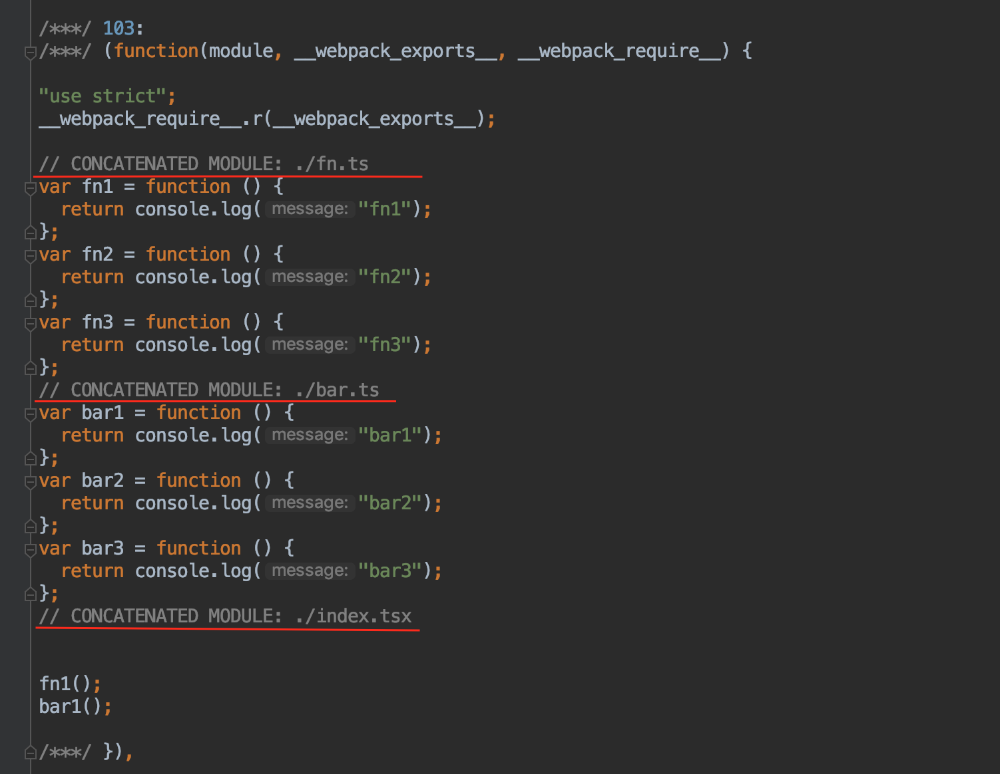

# Tree Shaking

## Tree  Shaking 是什么？

Tree Shaking 的字面意思是「摇树」，

## Tree Shaking 原理

tree shaking 并不删除死代码，只是标记

Roll up 和 Webpack 对比

- node_modules 里面的代码

- 非 node_modules 的代码

## Tree Shaking 失效了？

Webpack 升级之后可以 import * as xxx?

只有在 production 模式下才会生效。

