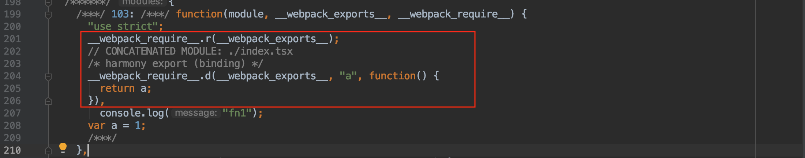
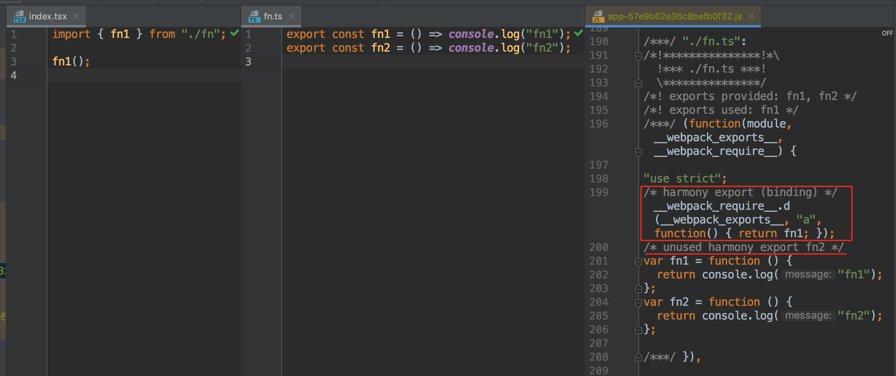

# Tree Shaking

Tree Shaking 已经出现很久了，想必大家或多或少都听说过它。这项技术可以帮助我们删除项目中未被引用的代码，从而减少打包出来的代码量。我也在项目上用了很长时间，希望通过这篇文章跟大家分享我踩过的坑，并从原理和实践两个方面，对这项技术做一个系统的整理。


## 为什么需要 Tree  Shaking？

Tree  Shaking 的字面意思是「摇树」，就是将项目中一些没有用到的模块「摇」掉。在实际场景中，一个文件模块可能会导出多个函数，但其中只有一个被用到了，其他没有被用到的函数就成为了「死代码」。死代码就像树上的枯叶，不仅毫无用处，而且还会增加树的负担，因此我们需要把它「摇」掉，不让死代码进入最终的打包文件。

有的人可能会说，我把没用到的模块删了不就好了，为什么还需要 Tree Shaking？且不说三方依赖库中也会有很多没有用到的模块，那些随着项目迭代而不再需要的方法，真的还会有人记得去删除吗？

有的人又说了，我们可以使用 Uglify 或 Terser 这样的 JS 压缩工具来做死代码消除（Dead Code Elimination）。那些对应用程序不会造成任何影响或者不可达的代码会被删除，就像下面这样：


既然 Uglify 可以消除死代码，为什么还需要 Tree Shaking？原因是 Uglify 目前不能跨文件去做死代码消除。Uglify 会对文件的代码进行静态分析，然后将死代码从抽象语法树（AST）中删除。静态分析是指不运行代码，只从字面量上对代码进行分析。因此在静态分析时，require 函数不会被运行，无法得知文件 require 或 export 了哪些模块。另外，Uglify 只会对单个文件的 AST 进行分析，无法得知 export 的模块是否会被其他文件使用。





因此，在下面这种跨文件的场景下，UglifyJS 无法将没有用到的函数 `fn2` 消除。


但 Tree Shaking 可以帮我们解决这个问题，接下来就让我们一起来看看 Tree Shaking 是如何解决这个问题的。


## Tree Shaking 的原理是什么？

简单来说，Tree Shaking 的原理就是对你 import 的代码进行静态分析，如果发现没有被用到的部分就不再 export。没有 export 的代码就会被 Uglify 当成死代码删除。需要注意的是，Webpack 的 Tree Shaking 不会直接把没有用到的代码删除，真正删除代码的是 Uglify 或 Terser 这样的 JS 压缩工具。





在上面的例子中，fn 文件 export 了两个函数 `fn1` 和 `fn2`，但是只有 `fn1` 被用到了。Tree Shaking 对代码进行静态分析，发现 `fn2` 没有被任何地方使用到，于是就不再 export `fn2` 。就像下面这样：


```javascript
// 伪代码
export const fn1 = () => console.log("fn1");
const fn2 = () => console.log("fn2"); // Dead Code
```


这样 `fn2` 就成为了死代码，在之后 Uglify 时就会被删除。不过这一切都依赖于 ES6 模块的静态结构特性：

1. 在编译时就可以明确知道 import 或 export 了哪些模块。
2. 只能在文件顶层 import 或 export 模块，不能在条件语句中使用。
3. import 或 export 的模块名只能是字符串常量。
4. export 导出的模块是一个值的引用，而非值的拷贝。

在 ES6 模块出现之前，我们通常使用 CommonJS 模块来导入和导出模块。通过 require 方法可以动态导入一个模块，但是只有在运行时才能确定导入的模块是什么，因此无法进行静态分析。由于静态结构特性，ES6 模块的依赖关系在编译时就能够明确，为 Tree Shaking 进行静态分析打下了坚实的基础。


## 如何使用 Tree Shaking？

就拿 Webpack 的 Tree Shaking 来说吧。你需要注意下面几点：


1. 将 mode 选项设置为 production，以启用 tree shaking 和 minification (代码压缩) 。
2. 使用 ES6 模块语法（即 `import` 和 `export`）。
3. 确保没有 compiler 将 ES6 模块语法转换为 CommonJS 模块。这一点很重要，在你使用 babel-loader 或者 ts-loader 编译代码时，一定要保留 import 和 export，否则 Tree Shaking 无法生效。


在没有 Tree Shaking 之前，为了避免把三方库的所有代码都打包到 Bundle 文件中，我们只能采用「按需引用」的方式。就拿 lodash 来说吧，我们会将 lodash 的每个方法打包成一个单独的文件，在使用的地方「按需引用」。比如：


```javascript
import map from "lodash/map";
import get from "lodash/get";
```


有了 Tree Shaking 之后，我们只需要保证引入的三方库是以 ES Module 导出的即可。对于不是 ES6 Module 导出的三方库，我们可以编译时使用它对应的 ES Module 的版本。比如用 `lodash-es` 替换 `lodash`:


```json
{
  resolve: {
    alias: {
      lodash: "lodash-es",
    },
  },
}
```


## Tree Shaking 失效了吗？

本以为有了 Tree Shaking 之后，再也不用担心引入多余模块的问题了。可是在实际场景中，当我使用 Webpack 打包时，却发现许多未使用的模块并没有被删除。难道 Tree Shaking 失效了吗？当然不是，前面已经说过，Tree Shaking 的工作只是不再 export 没有用到的模块，至于这个模块会不会被删除，是由 Uglify 或 Terser 这样的 JS  压缩工具决定的。如果你的代码有「副作用」，或者 Uglify 无法判断你的代码是否有「副作用」，那么就不会删除你的代码。


>  副作用是函数式编程的一个概念，是指当调用函数时，除了返回函数值之外，还会对主调用函数产生附加的影响。简单来说，就是除了返回函数值之外，还做了一些别的事情。比如打印 Log、读取和修改外部变量等。引申到应用层面，副作用还可能是导入 CSS 文件、引入 Polyfill 等。


为什么有副作用的代码不能被删除呢？举个简单的例子：


```javascript
const setTitle = () => {
  document.title = "Chengdu";
};

const a = setTitle();
```


在上面的例子中，虽然 `a` 变量没有被任何地方使用到，但是由于副作用，在为它赋值时会使 document 的 title 被设置为 「Chengdu」。如果把 `a` 变量删除，会导致 document 的 title 无法被正确设置。因此，删除有副作用的代码可能导致应用程序出现 bug 甚至 crash。

有的人可能会说，那不在项目中写这种带副作用的代码就行了呗？当然，确实不应该在项目中写这种带副作用的代码。不过即便我们不写，也有可能产生带副作用的代码，比如将代码从 ES6 编译成 ES5。


我们定义了一个简单的类，如下所示：


```typescript
class Greet {
  greeting() {
    return "hello";
  }
}
```


在打包时，为了适配低版本浏览器，我们通常会把 ES6 代码编译成 ES5。在 Class 出现之前，我们是通过 ES5 的构造函数来生成实例对象的，就像下面这样：


```javascript
function Greet() {
}

Greet.prototype.greeting = function () {
  return "hello";
};
```


那实际结果是不是跟我们想的一样呢？我先用 TypeScript 编译了一下，结果如下：


```javascript
var Greet = /** @class */ (function () {
    function Greet() {
    }
    Greet.prototype.greeting = function () {
        return "hello";
    };
    return Greet;
}());
```


跟我们猜想的差不多，不过 `Greet` 类被封装成了一个立即执行函数。这段代码看起来没有任何副作用，应该能够被删除吧？于是我赶紧用 Rollup 和 Terser 试了一下，结果却不尽如人意。这段代码在 Rollup 被删除了，但是在 Terser 却没有被删除。


[Rollup 传送门](https://rollupjs.org/repl/?version=1.27.5&shareable=JTdCJTIybW9kdWxlcyUyMiUzQSU1QiU3QiUyMm5hbWUlMjIlM0ElMjJtYWluLmpzJTIyJTJDJTIyY29kZSUyMiUzQSUyMnZhciUyMEdyZWV0JTIwJTNEJTIwJTJGKiolMjAlNDBjbGFzcyUyMColMkYlMjAoZnVuY3Rpb24lMjAoKSUyMCU3QiU1Q24lMjAlMjAlMjAlMjBmdW5jdGlvbiUyMEdyZWV0KCklMjAlN0IlNUNuJTIwJTIwJTIwJTIwJTdEJTVDbiUyMCUyMCUyMCUyMEdyZWV0LnByb3RvdHlwZS5ncmVldGluZyUyMCUzRCUyMGZ1bmN0aW9uJTIwKCklMjAlN0IlNUNuJTIwJTIwJTIwJTIwJTIwJTIwJTIwJTIwcmV0dXJuJTIwJTVDJTIyaGVsbG8lNUMlMjIlM0IlNUNuJTIwJTIwJTIwJTIwJTdEJTNCJTVDbiUyMCUyMCUyMCUyMHJldHVybiUyMEdyZWV0JTNCJTVDbiU3RCgpKSUzQiUyMiUyQyUyMmlzRW50cnklMjIlM0F0cnVlJTdEJTVEJTJDJTIyb3B0aW9ucyUyMiUzQSU3QiUyMmZvcm1hdCUyMiUzQSUyMmNqcyUyMiUyQyUyMm5hbWUlMjIlM0ElMjJteUJ1bmRsZSUyMiUyQyUyMmFtZCUyMiUzQSU3QiUyMmlkJTIyJTNBJTIyJTIyJTdEJTJDJTIyZ2xvYmFscyUyMiUzQSU3QiU3RCU3RCUyQyUyMmV4YW1wbGUlMjIlM0FudWxsJTdE)

[Terser 传送门](https://try.terser.org/)


为什么呢？明明我的代码没有副作用，为啥 Terser 删不了？为了弄清楚原因，我逐行 debug，看看究竟是哪一行影响了 Terser 的判断。当我把 `return Greet` 删除后，Terser 居然就能够正确删除了，这让我变得更加疑惑。

`return Greet` 之后，就相当于给 `Greet ` 变量赋了一个值。这个值可能会在其他地方被修改。但是由于 Terser 没有完善的程序流分析，它只能简单的判断变量后续是否被引用、修改，无法判断变量完整的修改过程。因此 Terser 不知道上面这段代码是否会产生副作用，当它无法判断时，只能选择不删除。而 Rollup 有相对完善的程序流分析，因此可以更好地判断代码是否有副作用。那在项目中没有用 Rollup 而是用了 Terser 该怎么办呢？请接着往下看。


接下来，我又拿 Babel 编译试了一下，结果如下：


[Babel 传送门]([代码](https://babeljs.io/repl#?babili=false&browsers=&build=&builtIns=false&spec=false&loose=false&code_lz=MYGwhgzhAEDiBOBTRAXaBvAUNaBzJqAlgHa4AUAlBtjtEigK7zHQBEAFoiCAPasDcNAL6YhQA&debug=false&forceAllTransforms=false&shippedProposals=false&circleciRepo=&evaluate=false&fileSize=false&timeTravel=false&sourceType=module&lineWrap=true&presets=es2016%2Ces2017%2Ctypescript%2Cenv&prettier=false&targets=&version=7.7.4&externalPlugins=))


可以看到，Babel 编译出来的代码跟之前差距很大。因为在 Babel 严格模式下，会遵循 ES6 的语义去编译代码。就拿 Class 来说，你可以把它看成是 ES5 构造函数的一个语法糖。可是它却比普通的构造函数多了许多限制，例如必须使用 new 关键字来调用、类内部的方法不可枚举等等。

在生成的代码中，`_defineProperties` 通过调用 `Object.defineProperty` 方法修改了传入的参数 `target`，这样就产生了副作用。前面也提到过，如果你的代码有副作用，Terser 就不会把它删掉。那是不是所有 Class 都不能被删除了？别慌，我们先把 Babel 编译好的代码分别放到 Rollup 和 Terser 上试一下。什么？居然都被删除了？


[Rollup 传送门](https://rollupjs.org/repl/?version=1.27.5&shareable=JTdCJTIybW9kdWxlcyUyMiUzQSU1QiU3QiUyMm5hbWUlMjIlM0ElMjJtYWluLmpzJTIyJTJDJTIyY29kZSUyMiUzQSUyMigoKSUyMCUzRCUzRSUyMCU3QiU1Q24lMjAlMjBmdW5jdGlvbiUyMF9jbGFzc0NhbGxDaGVjayhpbnN0YW5jZSUyQyUyMENvbnN0cnVjdG9yKSUyMCU3QiU1Q24lMjAlMjAlMjAlMjBpZiUyMCghKGluc3RhbmNlJTIwaW5zdGFuY2VvZiUyMENvbnN0cnVjdG9yKSklMjAlN0IlNUNuJTIwJTIwJTIwJTIwJTIwJTIwdGhyb3clMjBuZXclMjBUeXBlRXJyb3IoJTVDJTIyQ2Fubm90JTIwY2FsbCUyMGElMjBjbGFzcyUyMGFzJTIwYSUyMGZ1bmN0aW9uJTVDJTIyKSUzQiU1Q24lMjAlMjAlMjAlMjAlN0QlNUNuJTIwJTIwJTdEJTVDbiU1Q24lMjAlMjBmdW5jdGlvbiUyMF9kZWZpbmVQcm9wZXJ0aWVzKHRhcmdldCUyQyUyMHByb3BzKSUyMCU3QiU1Q24lMjAlMjAlMjAlMjBmb3IlMjAodmFyJTIwaSUyMCUzRCUyMDAlM0IlMjBpJTIwJTNDJTIwcHJvcHMubGVuZ3RoJTNCJTIwaSUyQiUyQiklMjAlN0IlNUNuJTIwJTIwJTIwJTIwJTIwJTIwdmFyJTIwZGVzY3JpcHRvciUyMCUzRCUyMHByb3BzJTVCaSU1RCUzQiU1Q24lMjAlMjAlMjAlMjAlMjAlMjBkZXNjcmlwdG9yLmVudW1lcmFibGUlMjAlM0QlMjBkZXNjcmlwdG9yLmVudW1lcmFibGUlMjAlN0MlN0MlMjBmYWxzZSUzQiU1Q24lMjAlMjAlMjAlMjAlMjAlMjBkZXNjcmlwdG9yLmNvbmZpZ3VyYWJsZSUyMCUzRCUyMHRydWUlM0IlNUNuJTIwJTIwJTIwJTIwJTIwJTIwaWYlMjAoJTVDJTIydmFsdWUlNUMlMjIlMjBpbiUyMGRlc2NyaXB0b3IpJTIwJTdCJTVDbiUyMCUyMCUyMCUyMCUyMCUyMCUyMCUyMGRlc2NyaXB0b3Iud3JpdGFibGUlMjAlM0QlMjB0cnVlJTNCJTVDbiUyMCUyMCUyMCUyMCUyMCUyMCU3RCU1Q24lMjAlMjAlMjAlMjAlMjAlMjBPYmplY3QuZGVmaW5lUHJvcGVydHkodGFyZ2V0JTJDJTIwZGVzY3JpcHRvci5rZXklMkMlMjBkZXNjcmlwdG9yKSUzQiU1Q24lMjAlMjAlMjAlMjAlN0QlNUNuJTIwJTIwJTdEJTVDbiU1Q24lMjAlMjBmdW5jdGlvbiUyMF9jcmVhdGVDbGFzcyhDb25zdHJ1Y3RvciUyQyUyMHByb3RvUHJvcHMlMkMlMjBzdGF0aWNQcm9wcyklMjAlN0IlNUNuJTIwJTIwJTIwJTIwaWYlMjAocHJvdG9Qcm9wcyklMjAlN0IlNUNuJTIwJTIwJTIwJTIwJTIwJTIwX2RlZmluZVByb3BlcnRpZXMoQ29uc3RydWN0b3IucHJvdG90eXBlJTJDJTIwcHJvdG9Qcm9wcyklM0IlNUNuJTIwJTIwJTIwJTIwJTdEJTVDbiUyMCUyMCUyMCUyMGlmJTIwKHN0YXRpY1Byb3BzKSUyMCU3QiU1Q24lMjAlMjAlMjAlMjAlMjAlMjBfZGVmaW5lUHJvcGVydGllcyhDb25zdHJ1Y3RvciUyQyUyMHN0YXRpY1Byb3BzKSUzQiU1Q24lMjAlMjAlMjAlMjAlN0QlNUNuJTIwJTIwJTIwJTIwcmV0dXJuJTIwQ29uc3RydWN0b3IlM0IlNUNuJTIwJTIwJTdEJTVDbiU1Q24lMjAlMjB2YXIlMjBHcmVldCUyMCUzRCU1Q24lMjAlMjAlMjAlMjAlMjAlMjAlMkYqJTIzX19QVVJFX18qJTJGJTVDbiUyMCUyMCUyMCUyMCUyMCUyMGZ1bmN0aW9uJTIwKCklMjAlN0IlNUNuJTIwJTIwJTIwJTIwJTIwJTIwJTIwJTIwZnVuY3Rpb24lMjBHcmVldCgpJTIwJTdCJTVDbiUyMCUyMCUyMCUyMCUyMCUyMCUyMCUyMCUyMCUyMF9jbGFzc0NhbGxDaGVjayh0aGlzJTJDJTIwR3JlZXQpJTNCJTVDbiUyMCUyMCUyMCUyMCUyMCUyMCUyMCUyMCU3RCU1Q24lNUNuJTIwJTIwJTIwJTIwJTIwJTIwJTIwJTIwX2NyZWF0ZUNsYXNzKEdyZWV0JTJDJTIwJTVCJTdCJTVDbiUyMCUyMCUyMCUyMCUyMCUyMCUyMCUyMCUyMCUyMGtleSUzQSUyMCU1QyUyMmdyZWV0aW5nJTVDJTIyJTJDJTVDbiUyMCUyMCUyMCUyMCUyMCUyMCUyMCUyMCUyMCUyMHZhbHVlJTNBJTIwZnVuY3Rpb24lMjBncmVldGluZygpJTIwJTdCJTVDbiUyMCUyMCUyMCUyMCUyMCUyMCUyMCUyMCUyMCUyMCUyMCUyMHJldHVybiUyMCU1QyUyMmhlbGxvJTVDJTIyJTNCJTVDbiUyMCUyMCUyMCUyMCUyMCUyMCUyMCUyMCUyMCUyMCU3RCU1Q24lMjAlMjAlMjAlMjAlMjAlMjAlMjAlMjAlN0QlNUQpJTNCJTVDbiU1Q24lMjAlMjAlMjAlMjAlMjAlMjAlMjAlMjByZXR1cm4lMjBHcmVldCUzQiU1Q24lMjAlMjAlMjAlMjAlMjAlMjAlN0QoKSUzQiU1Q24lN0QpKCklNUNuJTVDbiUyMiUyQyUyMmlzRW50cnklMjIlM0F0cnVlJTdEJTVEJTJDJTIyb3B0aW9ucyUyMiUzQSU3QiUyMmZvcm1hdCUyMiUzQSUyMmNqcyUyMiUyQyUyMm5hbWUlMjIlM0ElMjJteUJ1bmRsZSUyMiUyQyUyMmFtZCUyMiUzQSU3QiUyMmlkJTIyJTNBJTIyJTIyJTdEJTJDJTIyZ2xvYmFscyUyMiUzQSU3QiU3RCU3RCUyQyUyMmV4YW1wbGUlMjIlM0FudWxsJTdE)

[Terser 传送门](https://try.terser.org/)


细心的同学可能发现了，我们生成的代码怎么多了一行注释 `/*#__PURE__*/` ？没错，这就是示例代码能够被删除的关键。通过这行注释，可以告诉 JS 压缩工具：这个函数调用是没有副作用的，请放心地删除吧！

Babel7 已经为转译后的 ES6 Class 标记了 `/*#__PURE__*/`，所以在 Uglify 时，我们不用再担心 Class 不能被删除的问题了。对于项目中没有使用 Babel 或者想为其他函数调用标记 `/*#__PURE__*/` 的，可以使用这个三方库 [babel-plugin-pure-calls-annotation](https://github.com/morlay/babel-plugin-pure-calls-annotation)。它可以在需要地方自动为函数调用加上 `/*#__PURE__*/` ，比如当函数调用出现在赋值语句中、作为参数传递给另一个函数时。需要注意的是，使用这个库之后，请不要再像下面这样为有副作用的函数调用赋值，否则可能会导致代码被删除，从而产生 Bug。


```javascript
const subscription = sub$.subscribe(() => {
  subscription.unsubscribe();
});
```


### 小结

1. 对于有副作用的代码，或者无法判断是否有副作用的代码，Terser 不会将其删除。
2. 在编译的过程中可能会产生有副作用的代码。比如将代码从 ES6 编译成 ES5。
3. 尽量少写会产生副作用的代码。
4. 为函数调用标记 `/*#__PURE__*/` 注释，可以让 Terser 更好地删除无用代码。


## 工具版本

文章中用到的工具版本：

Webpack: v4.41.2

Babel: v7.7.4

Teser: v4.4.0

Rollup: v1.27.5


## 参考

1. [函数副作用](https://zh.wikipedia.org/wiki/函数副作用)

2. https://juejin.im/post/5a5652d8f265da3e497ff3de


-----------------------------


为了避免编译带来的副作用，能够先 Tree Shaking、Uglify 之后，再编译代码？如何实现？

Uglify 不支持 ES6 Module，只能使用 Terser。

通过 Bundle Analyze 分析引入的额外代码是否被删除

Terser -> Babel 的 scope？函数的 scope 内有哪些变量会被存储，分析 AST 时，如果 xxx(document) 没有在 scope 内，就可以判定为有副作用。更聪明了？把其他代码删掉，只保留有副作用的代码？

赋值语句都不要带副作用，带副作用的都不要赋值，比如 useEffect

注册给 export 等同于使用了它。

PURE 只给函数调用(Call Expression)加，什么样的 Call Expression 呢？变量赋值、作为函数的参数、作为函数的 Return 等。

画图展示 Tree Shaking 的过程。

document.title 取值也可能产生副作用？因为 getter, setter 是不透明的。

标记 sideEffect


```typescript
// foo.ts
export const a = (() => (Array.prototype.forEach = () => console.log("Hi!")))();
export const b = () => console.log("b");

// index.ts
import { b } from "./foo.ts";
b();
```


```typescript
const subscription = sub$.subscribe(() => {
  subscription.unsubscribe();
});

function setTitle(){
  document.title='1111'
  return 111
}

const a = /*#__PURE__*/setTitle()
```


```javascript
// import { map } from 'lodash';
// import map from 'lodash/map';


// import {map} from 'lodash'; //lodash-es
// import map form 'lodash/map';
// import * as React from 'react'; 也能被删除
```


如果不严格遵照 ES6 的语义进行编译呢？Babel 也提供了这样的方式，叫「宽松模式」，编译结果如下：


[Bebel 编译示例代码宽松模式](https://babeljs.io/repl#?babili=false&browsers=&build=&builtIns=false&spec=false&loose=true&code_lz=MYGwhgzhAEDiBOBTRAXaBvAUNaBzJqAlgHa4AUAlBtjtEigK7zHQBEAFoiCAPasDcNAL6YhQA&debug=false&forceAllTransforms=false&shippedProposals=false&circleciRepo=&evaluate=false&fileSize=false&timeTravel=false&sourceType=module&lineWrap=true&presets=es2016%2Ces2017%2Ctypescript%2Cenv&prettier=false&targets=&version=7.7.4&externalPlugins=)


太棒了！这样编译出来的 Class 确实没有副作用了。


```javascript
(() => {
  var Greet =
      function () {
        function Greet() {
        }

        var _proto = Greet.prototype;

        _proto.greeting = function greeting() {
          return "hello";
        };

        return Greet;
      }();
})()
```


打包过程可以拆分为四步：

1、利用 babel 完成代码转换,并生成单个文件的依赖

2、从入口开始递归分析，并生成依赖图谱

3、将各个引用模块打包为一个立即执行函数

4、将最终的 bundle 文件写入 bundle.js 中


Pollyfill/ call/bind/apply

先转换代码，再去死代码？Or 先去死代码再转换？

如何知道三方库是否使用 ES6 还是 ES5？

Webpack 升级之后可以 import * as xxx?

UglifyJS 不会跨文件去做 DCE，如果有 Scope Hoisting 还需要 Tree Shaking 吗？

Roll up 和 Webpack 对比

// harmony export 是什么？

// import React from 'react' 会导入所有模块吗？

// const abc = require("abc"); 会导入所有模块吗？

- node_modules 里面的代码
- 非 node_modules 的代码

