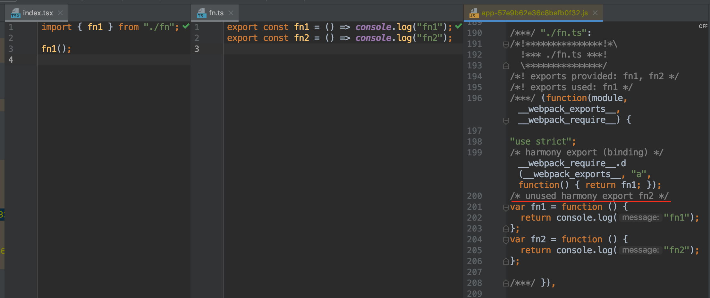

# Tree Shaking

Tree Shaking 已经出现很久了，想必大家或多或少都听说过它。这项技术可以帮助我们删除项目中没有用到的模块，从而减少打包出来的代码量。我也在项目上用了很长时间，希望通过这篇文章跟大家分享我踩过的坑，并从原理和实践两个方面，对这项技术做一个系统的整理。

## 为什么需要 Tree  Shaking？

Tree  Shaking 的字面意思是「摇树」，就是将项目中一些没有用到的模块「摇」掉。在实际场景中，一个文件模块可能会导出多个函数，但其中只有一个被用到了，其他没有被用到的函数就成为了「死代码」。死代码就像树上的枯叶，不仅毫无用处，而且还会增加树的负担，因此我们需要把它「摇」掉，不让死代码进入最终的打包文件。

有的人可能会说，我把没用到的模块删了不就好了，为什么还需要 Tree Shaking？且不说三方依赖库中也会有很多没有用到的模块，那些随着项目迭代而不再需要的方法，真的还会有人记得去删除吗？

有的人又说了，我们一般使用 UglifyJS 来做死代码消除（Dead Code Elimination），那些对应用程序不会造成任何影响或者不可达的代码会被消除，就像下面这样：

既然 UglifyJS 可以消除死代码，为什么还需要 Tree Shaking？原因是 UglifyJS 目前不能跨文件去做死代码消除。

## Tree Shaking 的原理是什么？

Tree Shaking 依赖于 ES6 模块的静态结构特性：

1. 在编译时就可以明确知道 import 或 export 了哪些模块。
2. 只能在文件顶层 import 或 export 模块，不能在条件语句中使用。
3. import 或 export 的模块名只能是字符串常量。
4. export 导出的模块是一个值的引用，而非值的拷贝。

静态分析的特点。

## 我的 Tree Shaking 为什么失效了？

Webpack 升级之后可以 import * as xxx?

只有在 production 模式下才会生效。

UglifyJS 不会跨文件去做 DCE，如果有 Scope Hoisting 还需要 Tree Shaking 吗？

UglifyJS 为什么不能跨文件去做 DCE？

标记 sideEffect

标记 PURE

tree shaking 并不删除死代码，只是标记

Roll up 和 Webpack 对比

// harmony export 是什么？

// webpack 是如何识别 unused xxx 标记的？

- node_modules 里面的代码
- 非 node_modules 的代码

