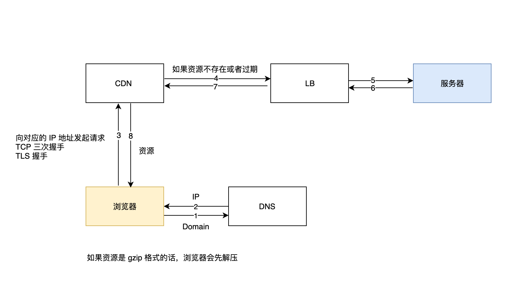
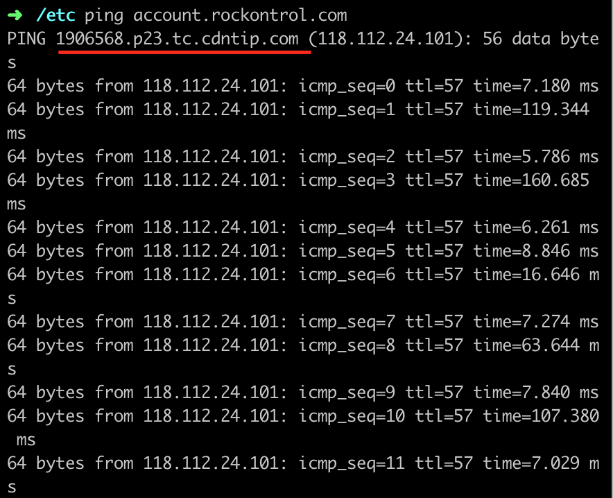

性能优化是一个非常大的主题，可能会贯穿架构、开发、打包、部署等各个环节，包含了很多琐碎零散的东西。要让一个应用的性能提升，绝非一朝一夕的事情，需要我们一点一滴地进行积累。文章会对项目上常用的一些性能优化的方法进行归纳和总结，希望能把这些零散的东西完整地呈现在大家面前。

文章会围绕以下两个问题进行：

1. 如何让资源（HTML/CSS/JS/图片/字体等）加载得更快？

2. 如何提升页面的渲染性能？比如更快地把页面渲染出来、减少页面卡顿等等。

   

在回答上面两个问题之前，我们需要知道：

1. 加载一个资源的过程

2. 浏览器是如何渲染页面的

   

了解这些知识非常必要，因为它们和性能优化息息相关。只有清楚了这些，我们才知道哪些环节可能出现性能问题，从而找出提升性能的方法。

## 加载一个资源的过程

DNS 寻址
traceroute
host: doman ip mapping
本地 DNS Server：/etc/resolv.conf

CDN：分布式内容网络，会根据用户所在的位置发送对应的页面或者其他静态资源。

- 访问 www.testing.com
- 用户所在地在成都
- CDN 提供商会给一个二级域名，作为跳板，那么访问到成都的出口 xx.0.0.0 时，就能够匹配到 match 的二级域名（联想 host file 内的 domain IP mapping，相同的 domain，比如本地有一个 ip 指向 zhihu.com，那么就会被拦截。先匹配到谁就返回谁的 IP）
- 同理访问到北京的出口 xxx.0.0.1时，就能够匹配到 match 的域名

TCP 连接的耗时，分包传输数据。

一、提升加载性能

1. 减少包的体积

   1. 优化 JavaScript
      1. Tree Shaking (lodash chain 会引入很多方法)
      2. Scope Hoisting 
      3. Uglify
      4. Code Split （Dynamic Import）
   2. 字体、图片压缩（大图和小图）

2. 缓存

   1. HTTP 缓存（JS/ICON/字体等）
   2. PWA 离线存储

3. 网络

   1. GZip
   2. DNS 预解析
   3. CDN
   4. 减少重复请求
   5. 减少 API 请求的频率（throttle/debounce）
6. 解决 HTTP 最大请求数的问题（HTTP2）
   
   

二、渲染性能

1. 提高首屏渲染速度
   1. Server Render
   2. Skeleton View
   
2. 输入时去抖动

3. 尽量减少复杂的布局抖动（回流和重绘）

4. 减少 DOM 操作，对 DOM 查询作进行缓存

5. 懒加载

6. 虚拟滚动

   

> 查看网页性能的工具

